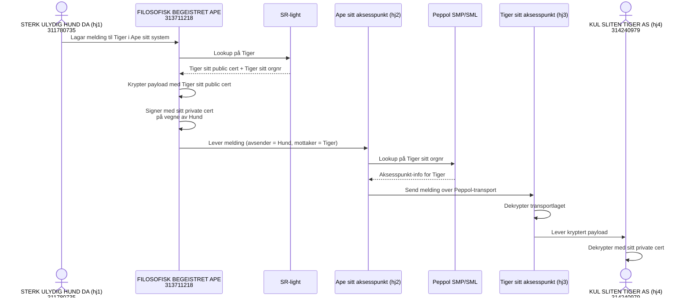
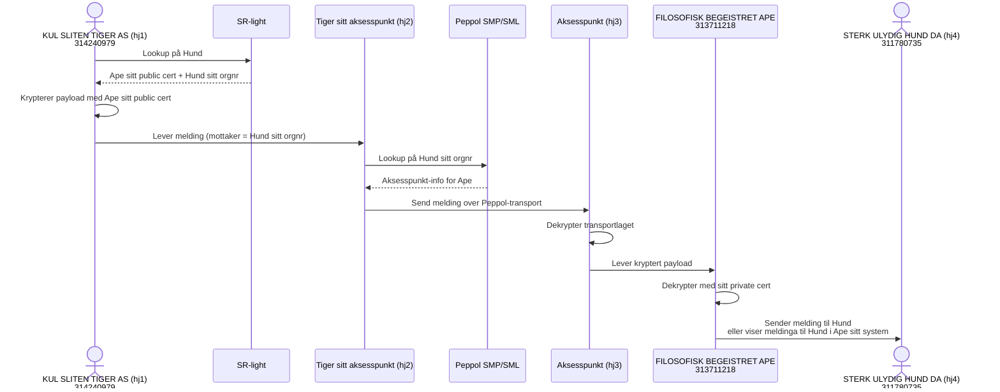

# På vegne av

STERK ULYDIG HUND DA (311780735) har ikkje eige krypteringssertifkat. FILOSOFISK BEGEISTRET APE (313711218) sender og mottar på vegne av STERK ULYDIG HUND DA (311780735), og meldingen krypteres med FILOSOFISK BEGEISTRET APE (313711218) sitt krypteringssertifi.at

## Case 1 Sending

FILOSOFISK BEGEISTRET APE (313711218) sender melding på vegne av STERK ULYDIG HUND DA (311780735) til KUL SLITEN TIGER AS (314240979)

Tiger må akseptere at meldingen er signert med APE sitt sertifikat og ikkje HUND sitt (HUND har jo ikkje eige sertifikat)

## Case 2 Receiving

KUL SLITEN TIGER AS (314240979) sender melding til STERK ULYDIG HUND DA (311780735).

FILOSOFISK BEGEISTRET APE (313711218) mottar melding på vegne av STERK ULYDIG HUND DA (311780735)

